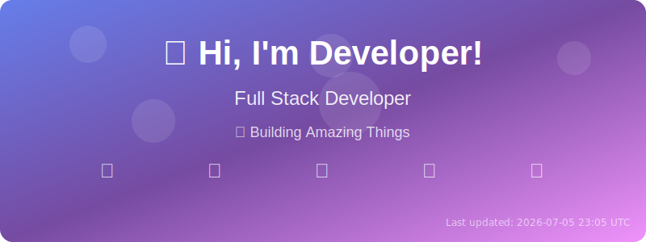

# Dynamic GitHub Profile README

<!-- HEADER-START -->

    

---

<!-- HEADER-END -->

<!-- QUOTES-START -->
## 😄 Daily Programming Humor

Why did the web developer walk out of a resturant in disgust?

The seating was laid out in tables.

<!-- QUOTES-END -->

<!-- VISITOR-COUNTER-START -->
## 👀 Profile Views

    

*Last updated: 2026-04-04 10:40:45 UTC*

<!-- VISITOR-COUNTER-END -->

<!-- AGE-START -->
## 🎂 About Me

    

**🌟 I'm 25 years old and have been alive for 9,481 days!**

*Age updates automatically every day*

<!-- AGE-END -->

<!-- TYPING-ANIMATION-START -->
## ⌨️ Typing Animation

    

<!-- TYPING-ANIMATION-END -->

<!-- LEETCODE-START -->
## 🧩 LeetCode Progress

    
    

### 📊 Problem Breakdown

| Difficulty | Solved | Percentage |
|------------|--------|------------|
| 🟢 Easy | 128 | 38.6% |
| 🟡 Medium | 123 | 37.0% |
| 🔴 Hard | 81 | 24.4% |

### 🏆 Statistics
- **Current Streak:** 1 days 🔥
- **Max Streak:** 28 days 🏅
- **Favorite Topics:** Array, String, Dynamic Programming, Tree

### 📝 Recent Problems
- 🔴 **Kadane's Algorithm** - Hard (2026-04-04)
- 🔴 **DFS Traversal** - Hard (2026-03-30)
- 🔴 **Sliding Window** - Hard (2026-03-28)

*Last updated: 2026-04-04 10:40:45 UTC*

<!-- LEETCODE-END -->

<!-- WEATHER-START -->
## 🌤️ Current Weather

<table>
<tr>
    <th>🌍 City</th>
    <th>🌡️ Temperature</th>
    <th>☁️ Condition</th>
    <th>💧 Humidity</th>
    <th>💨 Wind Speed</th>
</tr>
<tr>
    <td>Valsad</td>
    <td>29.7°C</td>
    <td>Sunny</td>
    <td>47%</td>
    <td>16.2 km/h</td>
</tr>
<tr>
    <td>Boston</td>
    <td>10.3°C</td>
    <td>Mist</td>
    <td>96%</td>
    <td>14.4 km/h</td>
</tr>
<tr>
    <td>London</td>
    <td>14.1°C</td>
    <td>Partly cloudy</td>
    <td>77%</td>
    <td>22.3 km/h</td>
</tr>
<tr>
    <td>Tokyo</td>
    <td>17.3°C</td>
    <td>Light rain shower</td>
    <td>83%</td>
    <td>42.8 km/h</td>
</tr>
</table>
<!-- WEATHER-END -->

## 🛠️ Tech Stack

    
    
    
    

## 📈 GitHub Stats

    

---

    <i>This README is automatically updated using GitHub Actions</i> 
    <i>Last updated: 2026-04-04 10:40:46 UTC</i>

