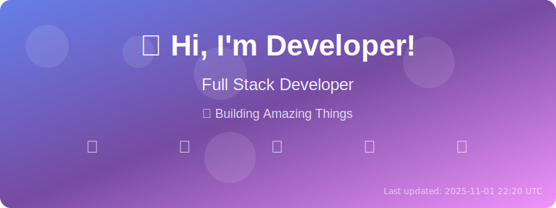

# Dynamic GitHub Profile README

<!-- HEADER-START -->

    

---

<!-- HEADER-END -->

<!-- QUOTES-START -->
## 😄 Daily Programming Humor

A programmer puts two glasses on his bedside table before going to sleep.
A full one, in case he gets thirsty, and an empty one, in case he doesn't.

<!-- QUOTES-END -->

<!-- VISITOR-COUNTER-START -->
## 👀 Profile Views

    

*Last updated: 2025-08-28 10:25:44 UTC*

<!-- VISITOR-COUNTER-END -->

<!-- AGE-START -->
## 🎂 About Me

    

**🌟 I'm 25 years old and have been alive for 9,262 days!**

*Age updates automatically every day*

<!-- AGE-END -->

<!-- TYPING-ANIMATION-START -->
## ⌨️ Typing Animation

    

<!-- TYPING-ANIMATION-END -->

<!-- LEETCODE-START -->
## 🧩 LeetCode Progress

    
    

### 📊 Problem Breakdown

| Difficulty | Solved | Percentage |
|------------|--------|------------|
| 🟢 Easy | 85 | 49.1% |
| 🟡 Medium | 65 | 37.6% |
| 🔴 Hard | 23 | 13.3% |

### 🏆 Statistics
- **Current Streak:** 1 days 🔥
- **Max Streak:** 23 days 🏅
- **Favorite Topics:** Array, String, Dynamic Programming, Tree

### 📝 Recent Problems
- 🔴 **Sliding Window** - Hard (2025-08-28)
- 🔴 **Sliding Window** - Hard (2025-08-24)
- 🟢 **Binary Search** - Easy (2025-08-23)

*Last updated: 2025-08-28 10:25:44 UTC*

<!-- LEETCODE-END -->

<!-- WEATHER-START -->
## 🌤️ Current Weather

<table>
<tr>
    <th>🌍 City</th>
    <th>🌡️ Temperature</th>
    <th>☁️ Condition</th>
    <th>💧 Humidity</th>
    <th>💨 Wind Speed</th>
</tr>
<tr>
    <td>Valsad</td>
    <td>29.0°C</td>
    <td>Patchy rain nearby</td>
    <td>76%</td>
    <td>11.5 km/h</td>
</tr>
<tr>
    <td>Boston</td>
    <td>14.4°C</td>
    <td>Clear</td>
    <td>67%</td>
    <td>7.6 km/h</td>
</tr>
<tr>
    <td>London</td>
    <td>20.1°C</td>
    <td>Moderate rain</td>
    <td>56%</td>
    <td>19.1 km/h</td>
</tr>
<tr>
    <td>Tokyo</td>
    <td>28.4°C</td>
    <td>Clear</td>
    <td>58%</td>
    <td>21.2 km/h</td>
</tr>
</table>
<!-- WEATHER-END -->

## 🛠️ Tech Stack

    
    
    
    

## 📈 GitHub Stats

    

---

    <i>This README is automatically updated using GitHub Actions</i> 
    <i>Last updated: 2025-08-28 10:25:45 UTC</i>

